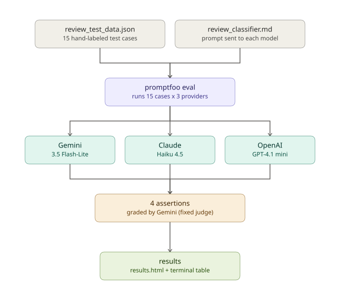
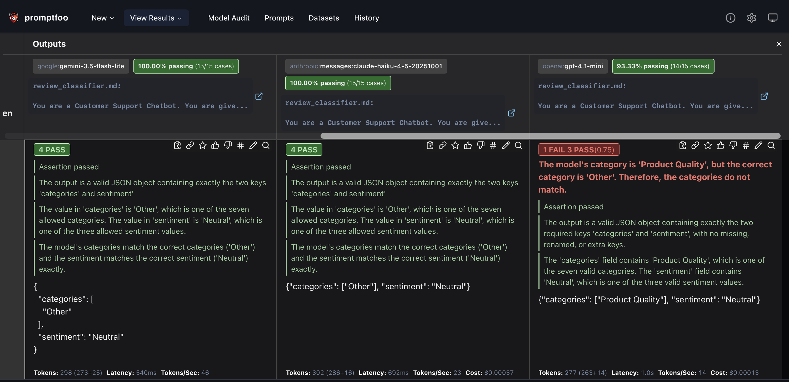

# Customer Review Classifier — Promptfoo Sentiment Eval


## 📌 Overview

This project evaluates an LLM based customer review classifier that assigns categories(multi-label) and sentiment(single-label) to product reviews,
using promptfoo to compare the model outputs against the golden dataset across multiple LLM providers.

## 🔄 Workflow



1. **`promptfooconfig.yaml`** — defines the three providers under test, the fixed 
   judge model, and the four assertions run against every response.
2. **`review_classifier.md`** — the prompt sent to each model under test.
3. **`review_test_data.json`** — 15 hand-labeled test cases with gold answers.


## 🖼️ Screenshots




## ✅ What it checks

- **is-json(Deterministic Metric)** - Valid JSON shape — correct keys (categories, sentiment), correct types (array, string)
- **llm-rubric(LLM-as-a-judge,Model-graded Metric)** - Correct field names — no renamed or invented keys
- **llm-rubric(LLM-as-a-judge,Model-graded Metric)** - Valid values — categories drawn only from the fixed 7-item list (or the Not specified fallback), sentiment from the 3-class list
- **llm-rubric(LLM-as-a-judge,Model-graded Metric)** - Correctness — the actual categories/sentiment match the gold answer for that specific review

## 📁 Project Structure

```
promptfoo-review-sentiment-eval

├── promptfooconfig.yaml     # providers, assertions, test file reference
├── review_classifier.md     # the prompt sent to the model under test
├── tests/
│   └── review_test_data.json  # 15 hand-labeled gold test cases
├── .env                      # API keys 
├── results.html              # Visual eval report (open in browser)
└── README.md

```


## 📊 Test Set & Results

15 hand-labeled reviews covering distinct difficulty types: clean single/multi-category, mixed sentiment across categories, vague/no-topic reviews, sarcasm, purely factual/neutral statements, 
category-adjacent confusion (price vs. quality overlap), and a topic-outside-the-list case (payment methods).

[View the full interactive results report](https://swatijanapana.github.io/promptfoo-review-sentiment-eval/results.html)


## Providers compared

| Provider | Model |
|---|---|
| Google | `gemini-3.5-flash-lite` |
| Anthropic | `claude-haiku-4-5-20251001` |
| OpenAI | `gpt-4.1-mini` |

The judge model (used for llm-rubric assertions) is fixed to Gemini across all three, so results are graded on a consistent standard regardless of which model is under test.

## 🛠️ Tools Used

- Promptfoo (Node.js-based CLI)
- Google Gemini, Anthropic Claude, OpenAI GPT — models under test
- Google Gemini — fixed judge model for LLM-as-a-judge assertions

## 🔧 Setup

1. Install [Node.js](https://nodejs.org/) (18+) and promptfoo:
   ```
   npm install -g promptfoo
   ```
2. Add your API keys to a `.env` file in the project root:
   ```
   GOOGLE_API_KEY=your_key_here
   ANTHROPIC_API_KEY=your_key_here
   OPENAI_API_KEY=your_key_here
   ```
3. Run the eval:
   ```
   promptfoo eval 
   ```
4. View results in the browser:
   ```
   promptfoo view
   ```
   
## 📊 Sample output

```
─────────────────────────────┬─────────────────────────────┬─────────────────────────────┬─────────────────────────────┬─────────────────────────────┬─────────────────────────────┐
│ review_text                 │ expected_categories         │ expected_sentiment          │ [google:gemini-3.5-flash-l… │ [anthropic:messages:claude… │ [openai:gpt-4.1-mini]       │
│                             │                             │                             │ review_classifier.md:       │ review_classifier.md:       │ review_classifier.md:       │
│                             │                             │                             │ You are a Customer Support  │ You are a Customer Support  │ You are a Customer Support  │
│                             │                             │                             │ Chatbot. You are give...    │ Chatbot. You are give...    │ Chatbot. You are give...    │
├─────────────────────────────┼─────────────────────────────┼─────────────────────────────┼─────────────────────────────┼─────────────────────────────┼─────────────────────────────┤
│ The build quality is        │ [                           │ Positive                    │ [PASS] {                    │ [PASS] {"categories":       │ [PASS] {"categories":       │
│ excellent, very sturdy and  │   "Product Quality"         │                             │   "categories": [           │ ["Product Quality"],        │ ["Product Quality"],        │
│ well made.                  │ ]                           │                             │     "Product Quality"       │ "sentiment": "Positive"}    │ "sentiment": "Positive"}    │
│                             │                             │                             │   ],                        │                             │                             │
│                             │                             │                             │   "sentiment": "Positive"   │                             │                             │
│                             │                             │                             │ }                           │                             │                             │
├─────────────────────────────┼─────────────────────────────┼─────────────────────────────┼─────────────────────────────┼─────────────────────────────┼─────────────────────────────┤
│ Not good.                   │ [                           │ Negative                    │ [PASS] {                    │ [PASS] {"categories":       │ [PASS] {"categories":       │
│                             │   "Other"                   │                             │   "categories": [           │ ["Other"], "sentiment":     │ ["Other"], "sentiment":     │
│                             │ ]                           │                             │     "Other"                 │ "Negative"}                 │ "Negative"}                 │
│                             │                             │                             │   ],                        │                             │                             │
│                             │                             │                             │   "sentiment": "Negative"   │                             │                             │
│                             │                             │                             │ }                           │                             │                             │
├─────────────────────────────┼─────────────────────────────┼─────────────────────────────┼─────────────────────────────┼─────────────────────────────┼─────────────────────────────┤
│ Oh great, another broken    │ [                           │ Negative                    │ [PASS] {                    │ [PASS] {"categories":       │ [PASS] {"categories":       │
│ item, exactly what I        │   "Product Quality"         │                             │   "categories": [           │ ["Product Quality"],        │ ["Product Quality"],        │
│ wanted.                     │ ]                           │                             │     "Product Quality"       │ "sentiment": "Negative"}    │ "sentiment": "Negative"}    │
│                             │                             │                             │   ],                        │                             │                             │
│                             │                             │                             │   "sentiment": "Negative"   │                             │                             │
│                             │                             │                             │ }                           │                             │                             │
├─────────────────────────────┼─────────────────────────────┼─────────────────────────────┼─────────────────────────────┼─────────────────────────────┼─────────────────────────────┤
│ It's a 12-inch item, comes  │ [                           │ Neutral                     │ [PASS] {                    │ [PASS] {"categories":       │ [FAIL] {"categories":       │
│ in a size medium and small  │   "Other"                   │                             │   "categories": [           │ ["Other"], "sentiment":     │ ["Product Quality"],        │
│ variant.                    │ ]                           │                             │     "Other"                 │ "Neutral"}                  │ "sentiment": "Neutral"}     │
│                             │                             │                             │   ],                        │                             │                             │
│                             │                             │                             │   "sentiment": "Neutral"    │                             │                             │
│                             │                             │                             │ }                           │                             │                             │
├─────────────────────────────┼─────────────────────────────┼─────────────────────────────┼─────────────────────────────┼─────────────────────────────┼─────────────────────────────┤      
``` 
## Notes

- `disableVarExpansion: true` is required in `defaultTest.options` — without it, promptfoo auto-splits multi-category test cases into separate single-category runs.
- All test case variables (`review_text`, `expected_categories`, `expected_sentiment`) live inside each test case's `vars` object, since only `vars` fields are available for `{{}}` templating in both the prompt and the assertions.

## 👩‍💻 Author
Swati J
